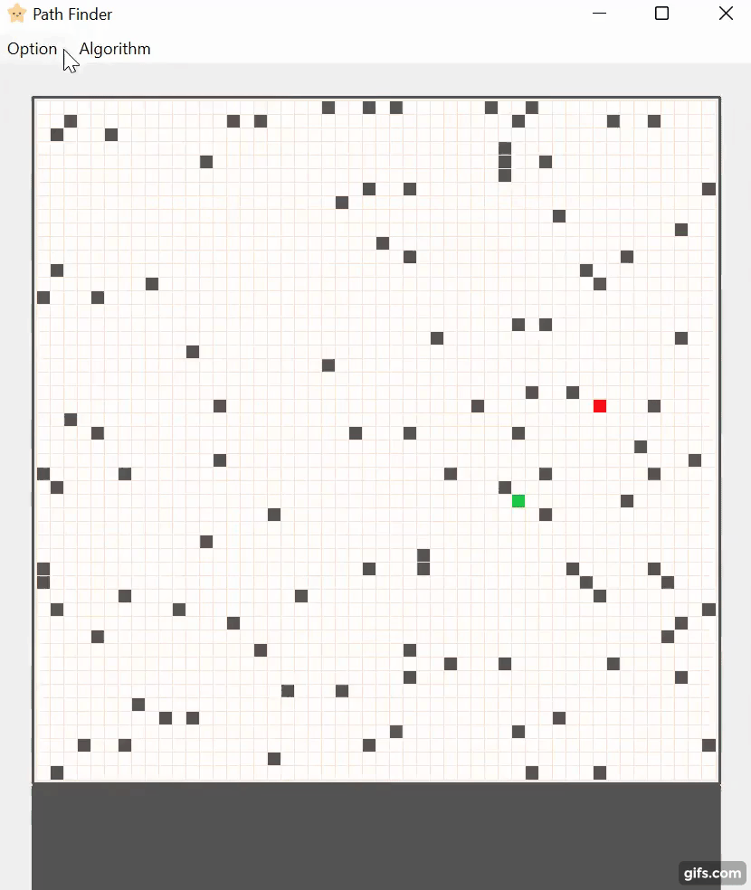
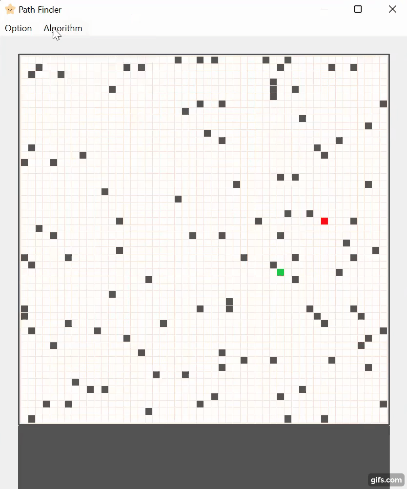

# Path Finder

### Find a path from a starting point to a destination using two algorithms:
1. Breadth first search
2. Depth first search
  

### Framework
Qt for creating graphical user interfaces
  

### Cell color
- start
- destination
- wall cannot be visited
- unvisited
- visited
- path
  

